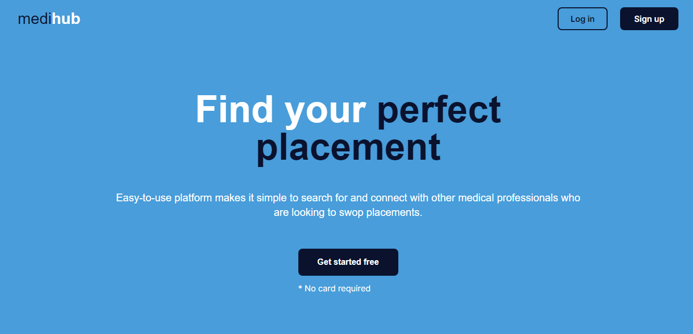
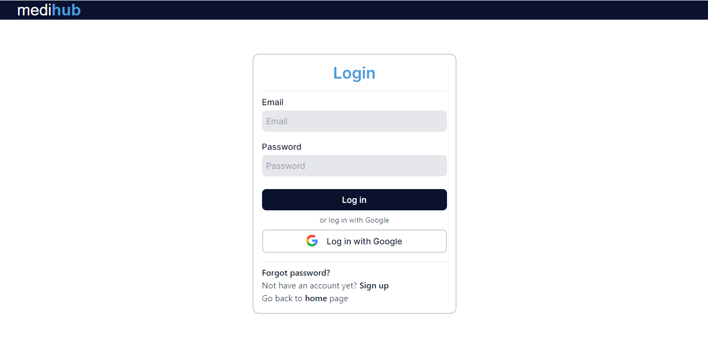
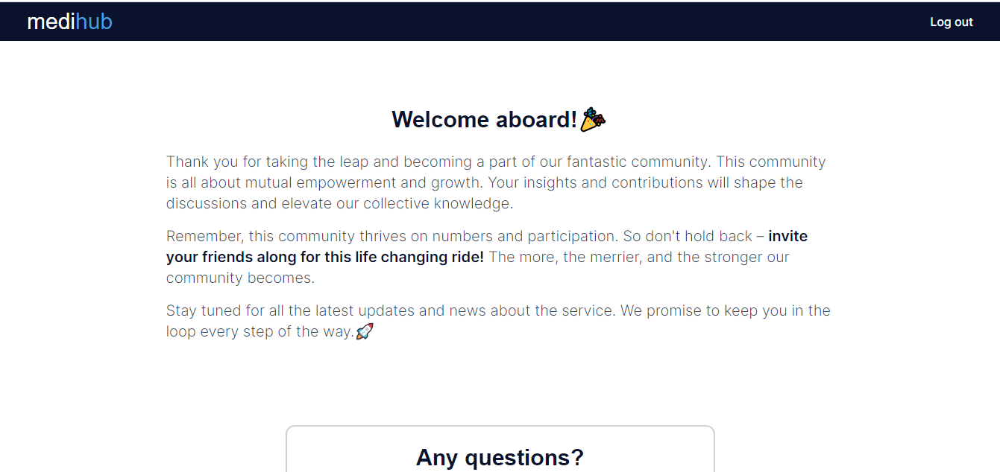
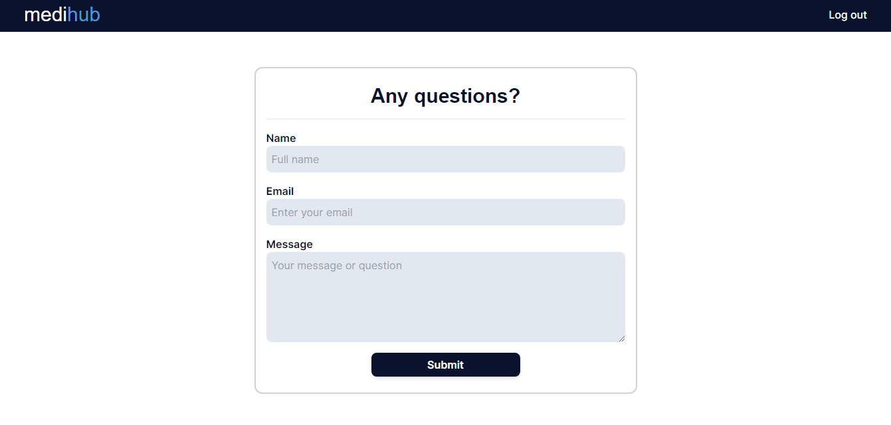

MediHub

Medihub software is designed to be an easy-to-use platform for medical students to communicate with each other. Currently the communication and interaction is spread out between platforms like Facebook, blogs, WhatsApp and Telegram groups. Medihub aims to bring all the user from the various platfroms together to create one thriving community. 

Tech stack:

- React.js
- Next.js

Core functionality:

- The current version is used for concept validation for a startup thus it currently has minimal functionality.
- Currently user can sign up and log in via email and password or Google (Firebase authentication and authorization).
- User can ask questions via a contact form (Nodemailer and gmail).

Surveys are currently being conducted and based on the responses and number of sign ups, more functionality will be added.

Screenshots:

-Landing page 

 

-Sign up

 

-Log in

-Home page 

 

-Contact form

 